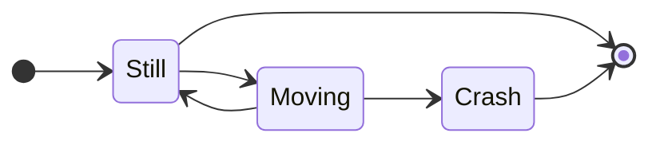

Not much to see here. Simply setting up the blog. Stay tuned.

Trying some math: $b \lor \neg b$.

Trying code highlighting:

<pre><code class="go">
package main
import "fmt"
func main() {
    fmt.Println("hello world")
}
</code></pre>

