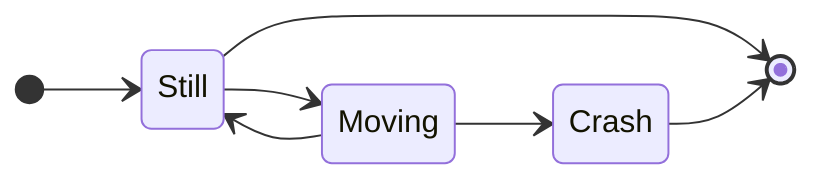

Not much to see here. Simply setting up the blog. Stay tuned.

Math mode is working:

$b \lor \neg b$.

Go highlighting is working:

<pre><code class="go">
package main
import "fmt"
func main() {
    fmt.Println("hello world")
}
</code></pre>

Quint highlighting is working:

```quint
module test {
  var n: int
  action init = { n' = 0 }
  action step = { n' = n + 1 }
}
```

Mermaid is not working:


